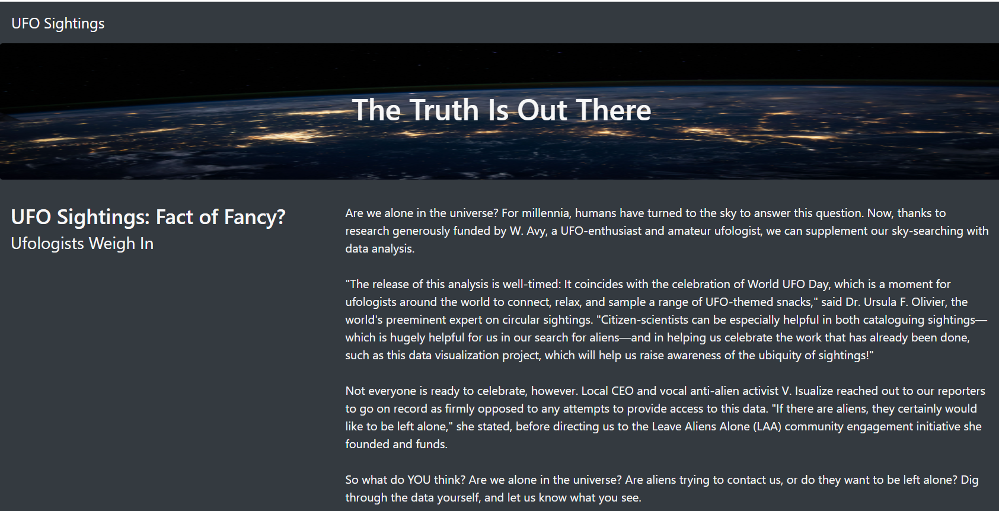
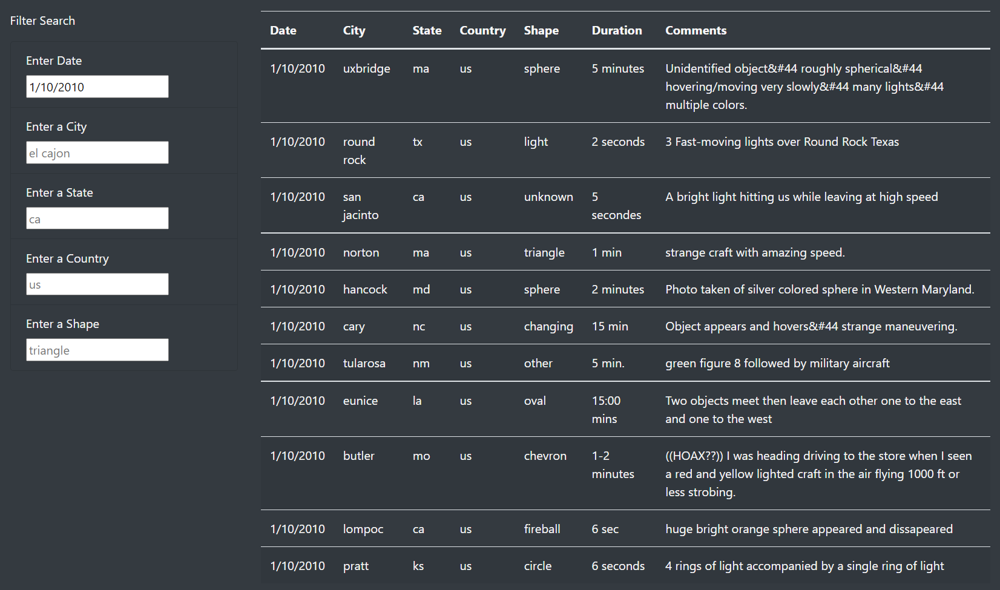
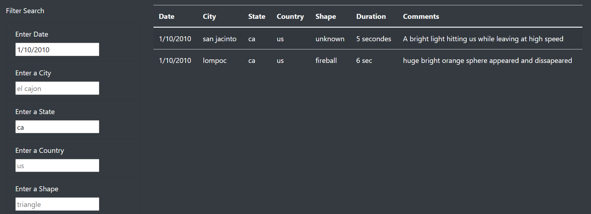
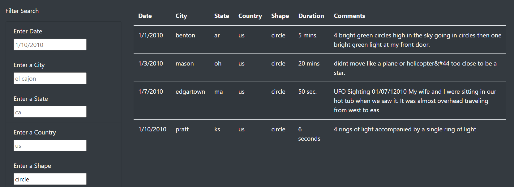

# UFOs

[link to deployed website](https://oscard79.github.io/UFOs/)

## Overview of the Project

The purpose of this project is to create a webpage with a dynamic table to research and review various UFO sightings around the United States. The table can be filtered by date, city, state, country and shape. This site would be great for someone who is researching UFO sightings and would like a way of organizing them with multiple options for filters. This is all completed using Javascript, Bootstrap, HTML and CSS.

## Results of the Project

 

 

The resulting page is one that captures the imagination with its aesthetics and entertains with it's clever insights introduction. However beyond that it has a versatile table that provides the user with multiple ways of reviewing the data. For example, if the user wanted to see all the UFO activity that took place on 1/10/2010, the user would only need to enter that in the search filter (see Fig1 below). Another option for the user is to see how many UFO sightings there were on a given day in a given state, the user would need to set the parameters in the filter to what they want in each filter and the site would update (see Fig2 below). Yet another feature that the user may be interested in is to enter a specific shape of the craft, this would bring up every instance that this occurred in the data (see Fig3 below). There are a myriad of different search capabilities.

 
Fig1
 

 
Fig2
 

 
Fig3
 

 

## Summary

In conclusion, the UFO webpage is aesthetic and functional, but it has room for improvement. The table functionality could be improved. It lacks the ability to search by range of dates and could benefit from a few cosmetic changes. I recommend that a second input box be entered to allow the user to add a start date and an end date to search through a range of dates. I also recommend instead of a 1/10/2010, el cajon, ca, us and circle as a place holders, these be updated to "Date", "City", "State", "Country" and "Shape", respectively. The webpage may also be more user friendly if there was a drop down option for the cities, states, shapes and countries (should additional countries be added later).

 
## Links to Files used:
 
 

[index.html](./index.html)

 

[app.js](./static/js/app.js)

 

[data.js](./static/js/data.js)

 

[style.css](./static/css/style.css)

